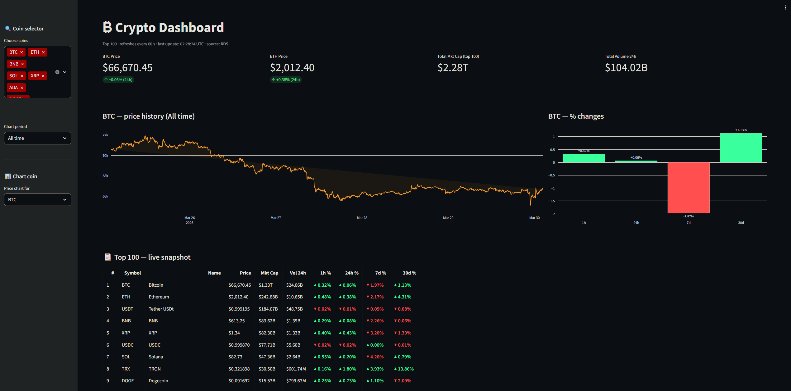
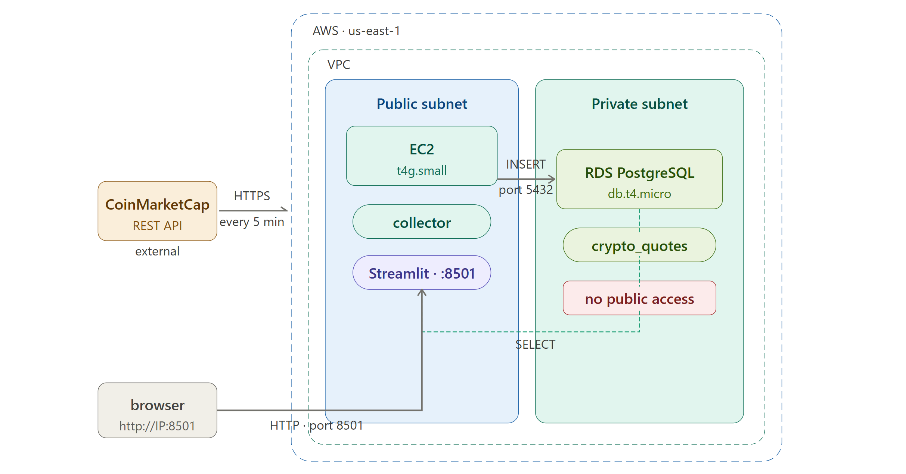

# Building a Real-Time Crypto Dashboard on AWS Free Tier

I built a real-time cryptocurrency price tracker that collects data from the CoinMarketCap API every 5 minutes, stores it in a PostgreSQL database on AWS RDS, and displays it through a Streamlit dashboard — all running 24/7 on AWS Free Tier. Here's how I thought through it and built it.

- Website



- Project Architecture



---

## The idea

The goal was simple: have a live dashboard I could share with friends showing real crypto prices, historical charts, and percentage changes. But instead of using a ready-made solution, I wanted to build the full pipeline myself — from API ingestion to cloud storage to visualization — and understand each piece.

---

## The data source: CoinMarketCap API

CoinMarketCap offers a free tier with 10,000 API credits per month. The endpoint I used is `/v1/cryptocurrency/listings/latest`, which returns the top N coins ranked by market cap in a single call.

One thing that tripped me up early: the course material I was following used `data['data']['BTC']` to access Bitcoin — but the API actually returns `data['data']` as a **list**, not a dictionary keyed by symbol. The correct way to find a specific coin is:

```python
bitcoin = next(item for item in data['data'] if item['symbol'] == 'BTC')
```

I also learned the difference between the sandbox and production endpoints. The sandbox returns completely fake data (random names, symbols, prices) — useful for testing the connection, but not for real data. The production URL is `https://pro-api.coinmarketcap.com/v1/cryptocurrency/listings/latest`.

### Credit budget

With a limit of 10,000 credits/month and 1 credit per call:

| Interval | Calls/day | Calls/month |
|---|---|---|
| every 15 seconds | 5,760 | ~173,000 ❌ |
| every 5 minutes | 288 | ~8,640 ✅ |

Collecting 100 coins per call at 5-minute intervals costs about 8,640 credits/month — comfortably within the free tier.

### What's stored per coin

Each collection round saves these fields for all 100 coins:

| Field | Description |
|---|---|
| `symbol` | Ticker (BTC, ETH, ...) |
| `name` | Full name |
| `cmc_rank` | CoinMarketCap ranking |
| `price` | Current price in USD |
| `volume_24h` | 24-hour trading volume |
| `market_cap` | Market capitalization |
| `pct_1h` | % change last 1 hour |
| `pct_24h` | % change last 24 hours |
| `pct_7d` | % change last 7 days |
| `pct_30d` | % change last 30 days |

I intentionally left out `cex_volume_24h`, `dex_volume_24h`, `fully_diluted_market_cap`, `percent_change_60d`, and `percent_change_90d` — these are more relevant for professional analysis and would just clutter a general-purpose dashboard.

---

## The architecture

The whole stack runs inside a single AWS region (`us-east-1`) with a clean separation between public and private resources.

```
CoinMarketCap API
       |
       | HTTPS (every 5 min)
       ↓
┌─────────────── AWS us-east-1 ───────────────────┐
│  ┌──────────── VPC ──────────────────────────┐  │
│  │                                           │  │
│  │  ┌─ Public subnet ─┐  ┌─ Private subnet ─┐│  │
│  │  │                 │  │                  ││  │
│  │  │  EC2 t4g.small  │──▶  RDS PostgreSQL  ││  │
│  │  │  (collector +   │  │   db.t3.micro    ││  │
│  │  │   Streamlit)    │  │  (no public IP)  ││  │
│  │  │  port 8501 open │  │  port 5432 only  ││  │
│  │  └─────────────────┘  │  from EC2 SG     ││  │
│  │         ▲             └──────────────────┘│  │
│  └─────────┼─────────────────────────────────┘  │
└────────────┼────────────────────────────────────┘
             │ HTTP :8501
           browser
```

**Key design decisions:**

The EC2 instance sits in a **public subnet** because it needs to reach the internet (CoinMarketCap API) and be reachable by users (Streamlit on port 8501).

The RDS instance sits in a **private subnet** with no public IP. It only accepts connections on port 5432 from the EC2 security group — no external access at all. This is the right pattern for any database in production.

Both run on AWS Free Tier eligible instances: `t4g.small` (ARM/Graviton2, 2 vCPUs, 2 GB RAM — free until December 2026) for the EC2, and `db.t3.micro` for RDS.

---

## The collector

The collector is a simple Python script that runs as a `systemd` service on EC2, keeping it alive 24/7 and restarting automatically on failure.

```python
# Fetch top 100 coins and save all at once
def fetch_and_store():
    response = session.get(URL, params={"limit": 100, "convert": "USD"})
    data = json.loads(response.text)
    save_coins(data["data"])

# Run immediately, then every 5 minutes
fetch_and_store()
schedule.every(5).minutes.do(fetch_and_store)
```

One important efficiency detail: instead of inserting one coin at a time, I use `executemany()` to batch all 100 inserts in a single database round-trip. This is significantly faster and puts less load on the RDS instance.

I also added a composite index on `(symbol, collected_at DESC)` — this makes the most common dashboard query (latest price for each coin) fast even as the table grows.

---

## The dashboard

The Streamlit app connects to RDS and renders three main sections:

**KPI row** — BTC price, ETH price, total market cap of top 100, and total 24h volume.

**Price history chart** — a Plotly area chart showing price over time for any selected coin. The sidebar lets you choose any of the 100 coins and switch between 1h, 6h, 24h, and 7-day windows.

**Live snapshot table** — all 100 coins with color-coded percentage badges (green for positive, red for negative).

The app has a local preview mode: if no `DB_HOST` is set in the environment, it falls back to a `sample_data.csv` file instead of connecting to RDS. This made development much easier since the RDS is private and not reachable from my local machine.

---

## Deployment

The systemd service configuration keeps both processes (collector and dashboard) running independently:

```ini
[Service]
EnvironmentFile=/home/ec2-user/crypto-dashboard/.env
ExecStart=/usr/bin/python3 /home/ec2-user/crypto-dashboard/collector/crypto_collector.py
Restart=always
RestartSec=10
```

The `.env` file holds all credentials (API key, RDS connection string) and is never committed to the repository. A `.env.example` with placeholder values is committed instead, so anyone cloning the repo knows exactly what to fill in.

---

## Repository

The full code is available on GitHub:

👉 **[github.com/your-username/crypto-dashboard](https://github.com/Jownao/crypto-dashboard)**

---

> **Note:** The dashboard may take 10–20 seconds to load on first visit. This is expected — the free tier instance is small and needs a moment to initialize the Python environment and establish the database connection. Subsequent loads are much faster thanks to Streamlit's caching layer.